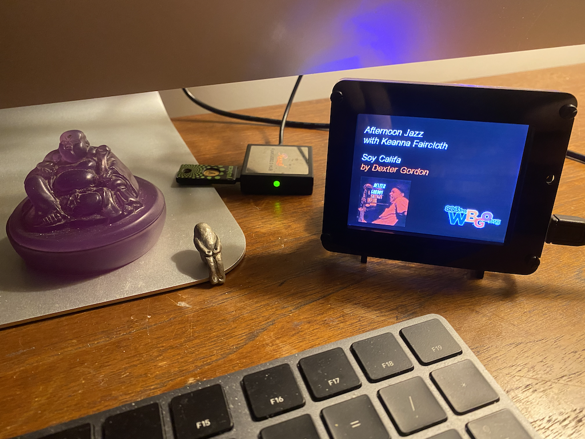
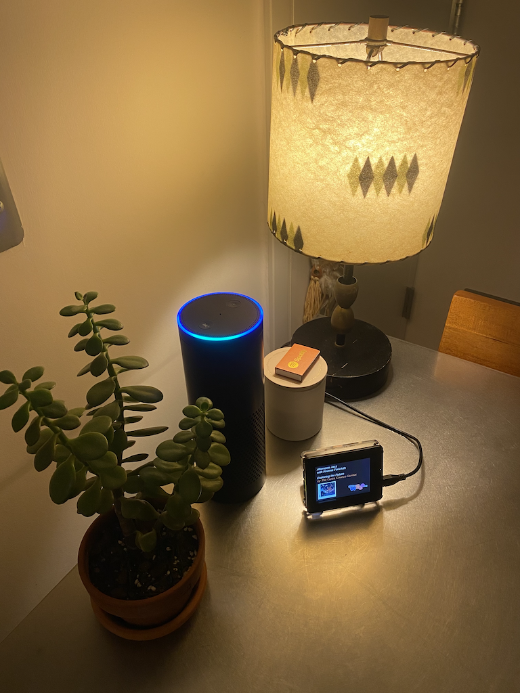

# PyPortal NPR Station

Use an [Adafruit PyPortal](https://www.adafruit.com/product/4116) to show what's currently playing on an [NPR](https://npr.org) station.

The project defaults to member-supported [WBGO 88.3 FM](https://wbgo.org) Newark Public Radio, the world’s premiere jazz public radio station.



_Great for listening and learning about Jazz._


## Prerequisites

- [Adafruit PyPortal](https://www.adafruit.com/product/4116)
- CircuitPython 5.3.1 – [download the UF2 from S3](https://adafruit-circuit-python.s3.amazonaws.com/bin/pyportal/en_US/adafruit-circuitpython-pyportal-en_US-5.3.1.uf2)
- Micro SD card – any size is fine

## Initial Setup

1\. Insert Micro SD

The app uses the card for local storage when it downloads and displays album art.

Make sure the card is **FAT32 formatted**, and plug it into the PyPortal.

Any size Micro SD card is fine since the app will write over the same file – `/sd/cover-image.bmp` – on each download.


2\. Update `secrets.py`

```
cp ./CIRCUITPY/secrets.py.tmpl ./CIRCUITPY/secrets.py
vim ./CIRCUITPY/secrets.py
```

[Adafruit IO](https://io.adafruit.com/) credentials are needed to convert and display album artwork.  Signing up for Adafruit IO is free and easy – not to mention it's a great service.

3\. Copy code to PyPortal

Drag and drop all the files from the repo's `CIRCUITPY` directory into the PyPortal's `CIRCUITPY` directory.

Or if you prefer the command-line:

```
rsync -avh ./CIRCUITPY/ /Volumes/CIRCUITPY
```

_Links to PyPortal documentation are available at the bottom of this page._

## Changing Stations

A few updates are needed to change the station:

1\. Find the `UCS` value for the [NPR Composer API](http://api.composer.nprstations.org/) for the target station:

This can usually be found by going to the station's online playlist search and using [Chrome Dev Tools](https://developers.google.com/web/tools/chrome-devtools) to find the background XHR requests to `/v1/widget/.../playlist`.

For example, go to [WRTI 90.1 FM](https://wrti.org/) playlist search:

- https://www.wrti.org/classical-playlist-search

and you'll see HTTP calls to:

```
https://api.composer.nprstations.org/v1/widget/53c7dbe1e1c8b9c77b4b9b6e/playlist?...
```

In the URL, the **53c7dbe1e1c8b9c77b4b9b6e** portion is the UCS number for the WRTI widget.

2\. Update the code:

Edit `code.py` and change the following lines:

```
STATION_DEFAULT_SHOW_NAME = "WRTI | Your Classical & Jazz Source"
STATION_DEFAULT_HOST_NAME = "WRTI Staff"
STATION_PLAYLIST_SLUG     = "53c7dbe1e1c8b9c77b4b9b6e"  # <~ the new UC
```

3\. Add a station logo _(optional)_:

Logos should be 120x50-pixel, 24-bit true color bitmaps with a black (`0x000000`) background for the best rending quality.

The logo file must be named `${UCS}_slug.bmp` – where `${UCS}` is the station token identied above.  The file must be placed the top of the `CIRCUITPY` directory, e.g.

```
$ ls /Volumes/CIRCUITPY/*_slug.bmp
/Volumes/CIRCUITPY/53c7dbe1e1c8b9c77b4b9b6e_slug.bmp
```

On MacOS, you can use `convert` to covert from another image format to bitmap:

```
convert ./120x50-source-image.png -type truecolor /Volumes/CIRCUITPY/53c7dbe1e1c8b9c77b4b9b6e_slug.bmp
```

`convert` can be installed via [Homebrew](https://formulae.brew.sh/formula/imagemagick), if necessary.

## Action Shots



_The perfect companion for [Amazon Alexa](https://alexa.amazon.com)._

## Related Info

#### NPR Composer API

- API Documentation
  - http://api.composer.nprstations.org/

- WBGO Playlist
  - https://api.composer.nprstations.org/v1/widget/5834b54de1c8aada9f4d7a9e/playlist?limit=2

- Example NPR Composer API UCS values:
  - WBGO 88.3 FM: `5834b54de1c8aada9f4d7a9e`
  - WRTI 90.1 FM: `53c7dbe1e1c8b9c77b4b9b6e`


#### Adafruit

- Adafruit PyPortal product page
  - https://www.adafruit.com/product/4116
- Adafruit PyPortal tutorial
  - https://learn.adafruit.com/adafruit-pyportal
- Adafruit PyPortal Hardware FAQ
  - https://learn.adafruit.com/adafruit-pyportal/pyportal-hardware-faq
- Latest CircuitPython for PyPortal
  - https://circuitpython.org/board/pyportal/
  - This project uses CircuitPython v5.3.x
- Latest CircuitPython Libraries
  - https://circuitpython.org/libraries
  - This project uses the v5.3.x libraries

## FAQs

#### Why am I getting a "Timeout waiting for v2 card" error with my Micro SD card?

If you see a "timeout waiting for v2 card" error, you may have a Micro SD card not supported by the PyPortal.  See [this blog post](https://www.devdungeon.com/content/pyportal-circuitpy-tutorial-adabox-011) for more insights on that issue.


#### Why is the portal a song ahead of the stream?

The playlist API is in sync with what's being broadcast over the airwaves. If you're listening to a digital stream, there's potential for a non-trivial amount of lag.  This lag is sometimes long enough to be one or more tracks behind the Composer API.

